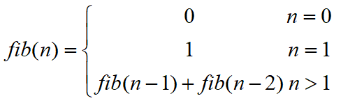

#### 经典案例

##### 1.Fibonacci数列


```c
#include<stdio.h>

long Fib(int n);
int main()
{
	int n,i=0;
	printf("Input n:");
	scanf("%d",&n);
	for ( i = 1; i<=n; i++)
	{
		printf("Fib(%d)=%d\n",i,Fib(i));
	}

	return 0;
}

long Fib(int n)
{
	if (n == 0)
		return 0;
	else if (n == 1)
		return 1;
	else
	{
		return (Fib(n - 1) + Fib(n - 2));
	}
}
```

##### 2.汉诺塔问题
思路和背景讲解参考https://dmego.me/2016/10/16/hanoi.html
```c
#include<stdio.h>
#pragma warning(disable : 4996)

void move(char src,char dest);
void hanoi(int n, char src,char mediun, char dest);		//src原判（移动前的盘），mediun中间盘（借步盘），dest目的盘

int main()
{
	int N;
	printf("请输入盘数：");
	scanf("%d",&N);
	printf("盘子的移动过程：\n");
	hanoi(N,'A','B','C');
	return 0;
}

void move(char src, char dest)
{
	printf("%c  -->  %c \n", src, dest);
}

void hanoi(int n, char src, char mediun, char dest)
{
	if (n == 1)
		move(src, dest);		//无论移动多少个盘中，最后一个盘（最大盘）的移动步骤都是直接移动到dest目的盘上，这也是这个问题的基线情况
	else
	{
		hanoi(n-1,src, dest, mediun);		
		move(src, dest);
		hanoi(n - 1, mediun, src, dest);
	}		
}
```